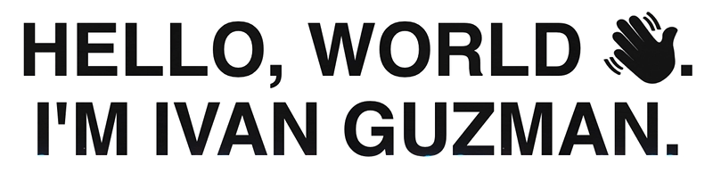

&nbsp;

## 📚 About Me:

&nbsp;

- 🚀 I am currently going through <a href = "(https://www.theodinproject.com/)"> The Odin Project </a> Full Stack JavaScript course.
- 🌱 I'm learning JavaScript.
- 🔭 I'm currently working on DOM manipulation.
- 😄 Pronouns: he/him/his
- ⚡️ Fun Fact: I am a father of two wonderful daughters.

&nbsp;

**Working With**

**Learning**

&nbsp;

## ☎️ Contact Me:

&nbsp;

## 📈 My Stats: 

&nbsp;

<!--
**ivngzmn/ivngzmn** is a ✨ _special_ ✨ repository because its `README.md` (this file) appears on your GitHub profile.

Here are some ideas to get you started:

- 🔭 I’m currently working on ...
- 🌱 I’m currently learning ...
- 👯 I’m looking to collaborate on ...
- 🤔 I’m looking for help with ...
- 💬 Ask me about ...
- 📫 How to reach me: ...
- 😄 Pronouns: ...
- ⚡ Fun fact: ...
-->
